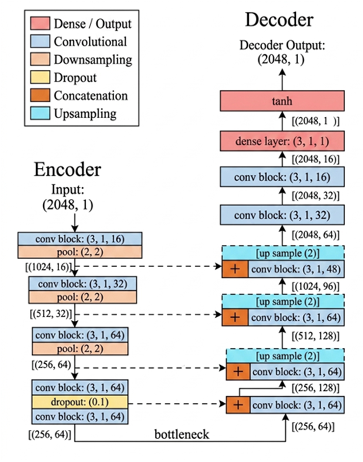
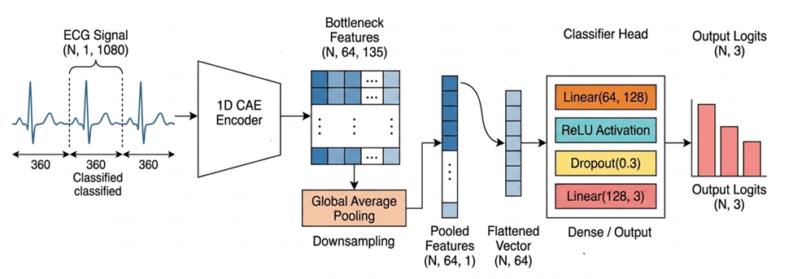

# 1D Convolutional Autoencoder for Joint ECG Signal Denoising and Arrhythmia Classification

This repository contains a PyTorch implementation of a computationally efficient deep learning framework for joint Electrocardiogram (ECG) signal denoising and diagnostic classification. Designed for resource-constrained wearable healthcare devices, the framework features a lightweight 1D Convolutional Autoencoder (CAE) with Skip Connections (SC) to suppress stochastic clinical artifacts while preserving critical morphological components (such as the QRS complex). Features from the pre-trained encoder bottleneck are then routed directly to a sequential classification head to provide high-fidelity automated arrhythmia detection.

---

## Table of Contents

* [Project Overview](#project-overview)
* [Dataset & Data Preparation](#dataset--data-preparation)
  * [Denoising Pipeline](#denoising-pipeline)
  * [Classification Pipeline](#classification-pipeline)
  * [Intra-Patient Split Distribution](#intra-patient-split-distribution)
* [Model Architecture](#model-architecture)
  * [1D Convolutional Autoencoder (CAE)](#1d-convolutional-autoencoder-cae)
  * [ECG Beat Classifier](#ecg-beat-classifier)
* [Loss Functions & Optimization](#loss-functions--optimization)
  * [Denoising Objectives](#denoising-objectives)
  * [Classification Objective](#classification-objective)
* [Evaluation Metrics & Results](#evaluation-metrics--results)
  * [Denoising Evaluation](#denoising-evaluation)
  * [Classification Evaluation](#classification-evaluation)
* [Course & Acknowledgments](#course--acknowledgments)

---

## Project Overview

ECG monitoring is essential for early cardiovascular disease intervention. However, raw physiological signals are inherently vulnerable to corruption from three primary ambient artifact groups:
1. **Baseline Wander (BW):** Low-frequency noise caused by patient respiration or movement.
2. **Muscle Artifacts (MA):** High-frequency noise generated by transient electromyographic activity (e.g., shivering, tremors).
3. **Electrode Motion (EM):** Large-amplitude non-stationary noise that can mimic legitimate heartbeat morphologies, posing a significant diagnostic challenge.

Traditional linear filters or wavelet thresholding (DWT/SWT) rely on manual tuning and static mathematical assumptions that lead to over-smoothing and distortion of vital wave segments (P-wave, T-wave, QRS complex). This framework provides an entirely data-driven alternative, leveraging non-linear structural constraints to extract deep latent feature representations for dual enhancement and diagnostic tasks.

---

## Dataset & Data Preparation

### Denoising Pipeline
* **Base Dataset:** Clean ECG records are sourced from the **MIT-BIH Arrhythmia Database** using the Modified Limb Lead II (MLII) channel to guarantee uniform morphological configurations.
* **Noise Injection:** Raw signals are artificially corrupted with real baseline shifts and muscle tremors from the **MIT-BIH Noise Stress Test Database**. Noise is injected independently at three distinct Signal-to-Noise Ratios (SNRs): **0 dB, 1.25 dB, and 5 dB**.
* **Segmentation:** Continuous 30-minute records are sliced into uniform sliding windows of **2048 samples with 50% overlap** to ensure smooth, continuous transitions and capture at least 5 complete cardiac cycles per segment.
* **Normalization:** Amplitudes are scaled to a strict numerical range of `[-1, 1]`.

### Classification Pipeline
* **Beat Extraction:** Individual heartbeats are localized using annotated R-peaks, extracting a window of 360 samples (180 points before and 180 points after the peak).
* **AAMI Standard Mapping:** Beats are mapped into three standard clinical categories:
  * **N:** Normal / Non-Ectopic Beats
  * **S:** Supraventricular Ectopic Beats (SVEB)
  * **V:** Ventricular Ectopic Beats (VEB)
  *(Fusion 'F' and Unknown 'Q' beats are discarded due to clinical scarcity).*
* **Contextual Tensor:** To integrate local rhythmic trends, three consecutive beats are concatenated into a singular input dimension of shape `(1, 1080)`, where the classifier evaluates and labels the central target heartbeat.

### Intra-Patient Split Distribution
To eliminate patient-specific data leakage, dataset records are partitioned explicitly by subject. Three records are excluded out of 48 due to a lack of an MLII lead sequence.

* **Training Set (35 Subjects / 78%):** Records 100, 101, 106, 107, 108, 109, 111, 112, 113, 115, 117, 118, 122, 123, 124, 200, 201, 203, 205, 207, 208, 209, 210, 212, 213, 214, 215, 220, 222, 223, 228, 231, 232, 233, 234.
* **Validation Set (5 Subjects / 11%):** Records 103, 105, 119, 217, 221.
* **Testing Set (5 Subjects / 11%):** Records 116, 121, 202, 219, 230.
* **Excluded (3 Subjects):** Records 102, 104, 114.

#### Classification Class Breakdown:
| Class Label | Training | Validation | Testing |
| :---: | :---: | :---: | :---: |
| **N** | 69,517 | 8,424 | 10,554 |
| **S** | 2,703 | 2 | 64 |
| **V** | 5,949 | 1,042 | 194 |
| **Total** | **78,169** | **9,468** | **10,812** |

---

## Model Architecture

### 1D Convolutional Autoencoder (CAE)
The denoising core consists of a streamlined encoder-decoder network. The encoder compresses the noisy `(2048, 1)` array into a low-dimensional bottleneck block, stripping stochastic artifacts. Skip Connections (SC) route early high-resolution feature maps directly to symmetric decoder blocks to combat over-smoothing and restore the sharp physiological slopes of the QRS transitions.

#### Convolutional Block Details (`StandardBlock`):
The network maps structural properties via nested 1D Convolutions ($k=3$, stride=1, padding=1), tracking batch normalization steps, and regularized through selective Dropout ($0.1$) layers inside the inner layers:
* `StandardBlock`: `Conv1D` $\rightarrow$ `BatchNorm1D` $\rightarrow$ `ReLU` $\rightarrow$ `Conv1D` $\rightarrow$ `BatchNorm1D` $\rightarrow$ `ReLU`.

### ECG Beat Classifier
The classification system reuses the pre-trained encoder weights of the 1D CAE. Latent space sequences extracted from a three-beat contextual matrix `(N, 64, 135)` pass through Global Average Pooling (GAP) down to `(N, 64, 1)`, are flattened to `(N, 64)`, and feed into a fully-connected Multilayer Perceptron (MLP) head:

$$\text{Linear}(64 \rightarrow 128) \rightarrow \text{ReLU} \rightarrow \text{Dropout}(0.3) \rightarrow \text{Linear}(128 \rightarrow 3) \rightarrow \text{Output Logits}$$

---

## Loss Functions & Optimization

### Denoising Objectives
Models can be evaluated via two customized reconstruction loss methodologies:
1. **Peak-Weighted Loss ($\mathcal{L}_{pw}$):** Formulates an MSE cost scaled dynamically by a peak emphasizing coefficient ($C_p$) to penalize attenuation near high-amplitude R-waves:
   $$C_p = 1 + |X_c - \text{median}(X_c)|$$
   $$\mathcal{L}_{pw}(X_c, X_d) = \frac{\sum ((X_c - X_d)^t \cdot (X_c - X_d) \cdot C_p)}{N}$$

2. **ECG Combined Loss ($\mathcal{L}_{Total}$):** A regularized multi-component target that aligns time, frequency, and morphological derivatives:
   $$\mathcal{L}_{Total} = w_{mse}\mathcal{L}_{MSE} + w_{peak}\mathcal{L}_{PW} + w_{dist}\mathcal{L}_{Dist} + w_{freq}\mathcal{L}_{Freq}$$
   * **Morphology Derivative Loss ($\mathcal{L}_{Dist}$):** Regulates sharp slope transitions using finite differences: $\Delta X_k = X_{k+1} - X_k$.
   * **Frequency Domain Loss ($\mathcal{L}_{Freq}$):** Enforces spectral consistency via Real FFT magnitude differentials ($|rFFT(X)_f|$).

### Classification Objective
To conquer the extreme class imbalances between Normal and Ectopic beats, **Focal Loss** is utilized to dynamically down-weight easy-to-classify patterns and concentrate optimization on sparse minority anomalies:

$$\mathcal{L}_{Focal} = \alpha_t (1 - p_t)^\gamma \cdot \mathcal{L}_{CE}$$

Where $p_t$ represents the softmax probability of the true target class, $\mathcal{L}_{CE}$ is the standard cross-entropy loss, and $\gamma$ balances hard vs. easy samples.

---

## Evaluation Metrics & Results

### Denoising Evaluation
Reconstruction quality is verified through Mean Squared Error (MSE), Percent Root-Mean-Square Difference (PRD), and SNR Improvement ($SNR_{Imp} = SNR_{denoised} - SNR_{noisy}$).

The table below catalogs the validation outcomes of the highly compressed `ResStackCAE Micro` variant optimized for 5 epochs:

| Noise Type | SNR Level | SNR Improv. (dB) | Denoised SNR (dB) | Noisy PRD (%) | Denoised PRD (%) | Noisy MSE | Denoised MSE |
| :--- | :---: | :---: | :---: | :---: | :---: | :---: | :---: |
| **Baseline** | 0.00 dB | **8.11** | 8.11 | 100.00 | 41.46 | 0.01567 | 0.00459 |
| **Wander** | 1.25 dB | **7.54** | 8.79 | 86.60 | 38.70 | 0.01027 | 0.00288 |
| **(BW)** | 5.00 dB | **5.04** | 10.04 | 56.23 | 34.31 | 0.00418 | 0.00220 |
| **Muscle** | 0.00 dB | **7.25** | 7.25 | 100.00 | 45.68 | 0.01407 | 0.00401 |
| **Artifact** | 1.25 dB | **6.94** | 8.19 | 86.60 | 41.18 | 0.01117 | 0.00352 |
| **(MA)** | 5.00 dB | **4.67** | 9.67 | 56.23 | 35.31 | 0.00450 | 0.00255 |

*Key Findings:* Denoising capability scales effectively under severe distortion constraints (lower input SNR values yield greater relative $SNR_{Imp}$). The streamlined framework shows slightly increased attenuation performance on low-frequency BW waveforms compared to high-frequency overlapping MA profiles.

### Classification Evaluation
Tested on the distinct intra-patient validation splits of the MIT-BIH Arrhythmia database, the joint encoder-classifier structure reaches the following performance benchmarks:
* **Overall Classification Accuracy:** **97.54%**
* **Macro-Average F1-Score:** **92.13%**
* **Light Baseline Distortion Denoising (RMSE):** **0.0335**

---

## Course & Acknowledgments

This framework was designed, implemented, and audited as part of the course **CSE672: Machine Learning**.

* **Authors:** Hala M. Shaheen, Huda M. Abdelhakim.
* **Academic Supervision:** Dr. Hazem M. Abbas, Ph.D., and Dr. Mahmoud I. Khalil, Ph.D.
* **Institution:** Computer and Systems Engineering Department, Faculty of Engineering, Ain Shams University, Cairo, Egypt.
